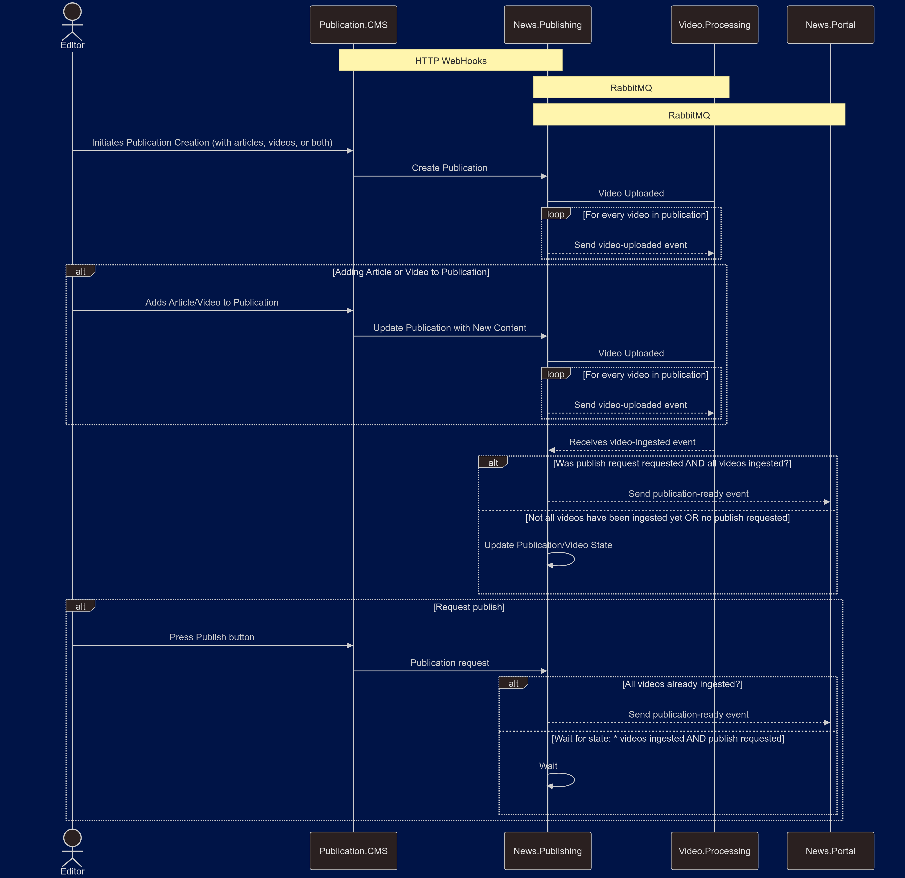

# News.Publishing

## 🌟 Overview
The **News.Publishing.Api** is a backend for managing the publishing flow of articles and videos. This service coordinates the creation, linking, and publication of content.



## 💻 Technologies Used
- 🛠️ **.NET 9**
- 📡 **[MassTransit](https://masstransit.io/)**: Provides RabbitMQ integration for the event-driven communication between services.
- 📦 **[Marten](https://github.com/JasperFx/marten)**: Used for event sourcing and data persistence.
- 🐳 **Docker & Docker Compose**: Used for containerizing the service and running it in different environments.

## 🚀 Getting Started
### 🔧 Prerequisites

- 🛠️ .NET SDK 9.0+ (Available [here](https://dotnet.microsoft.com/download))
- 🐳 PostgreSQL 12+ (Available [here](https://www.postgresql.org/download/)) 
- 🐳 Docker (Available [here](https://docs.docker.com/engine/install/))
- 🐰 RabbitMQ (Available [here](https://www.rabbitmq.com/docs/download))

The fastest possible way to develop with is to just start `News.Publishing.AppHost`project by hitting "F5" thanks to .NET Aspire.

Another possible way is to run PostgreSQL and RabbitMQ in a Docker container. Assuming that you have Docker running on your local box, type:
`docker compose up -d postgres rabbitmq`

### ▶️ Running the Service
1. **Clone the repository**:
    ```shell
    git clone https://github.com/dnovhorodov/News.Publishing.git
    cd News.Publishing
    ```

2. **Run dependencies**:
    ```shell
    docker compose up -d postgres rabbitmq
    ```

3. **Run service**:
    ```shell
    dotnet run --project ./src/News.Publishing.Api/News.Publishing.Api.csproj
    ```
4. **API Documentation**: Swagger is enabled for API documentation.
   Once the service is running, navigate to `http://localhost:5267/swagger/index.html` to explore the endpoints.

### 🧪 Testing
The service includes unit and integration tests to validate its functionality.

- 🧷 [FluentAssertions](https://github.com/fluentassertions/fluentassertions): For expressive assertions in unit tests.
- 📝 [Ogooreck](https://github.com/oskardudycz/Ogooreck): For BDD-style testing and scenario definitions.
- 🎲 [Bogus](https://github.com/bchavez/Bogus): For generating fake data to test various edge cases.
